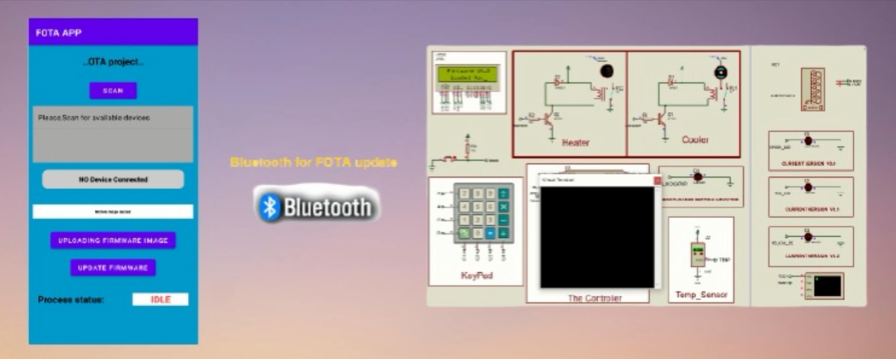
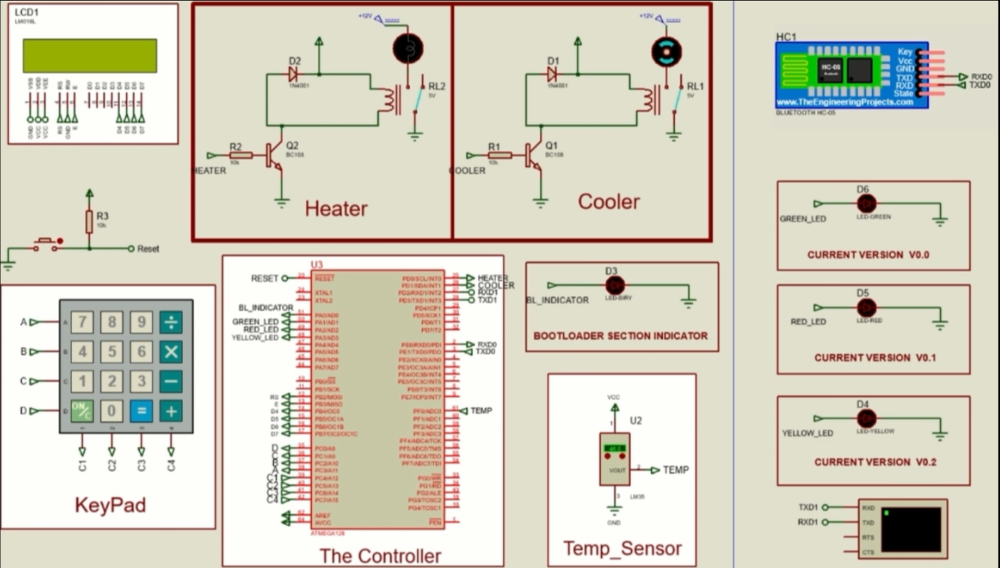

# Project Title
Bluetooth-Based FOTA System for ATmega128 Temperature Controller

## Project Description:
This project implements a Firmware Over-The-Air (FOTA) update system for an Automatic Temperature Controller using Bluetooth communication between an Android app and an ATmega128 microcontroller.

The system reads temperature values and compares them with a user-defined reference:
1. If actual temperature < reference, it activates the heater.
2. If actual temperature > reference, it activates the cooler.
3. 

## Technologies Used
1. ATmega128 Microcontroller (AVR)
2. HC-05 Bluetooth Module
3. UART Serial Protocol
4. Temperature sensor (LM35)
5. LCD + Keypad for interface
6. Custom Bootloader for OTA Flashing
7. Android Studio (Java)

## How Wireless OTA works(Bluetooth FOTA)
The system uses a BT-05 Bluetooth module connected via USART to the ATmega128.

A custom Android FOTA app is used to:
1. Scan and select paired devices.
2. Upload a .bin firmware file.
3. Send the binary over Bluetooth to the ATmega128 using uart.
4. The MCU writes the firmware into flash using a custom bootloader.

