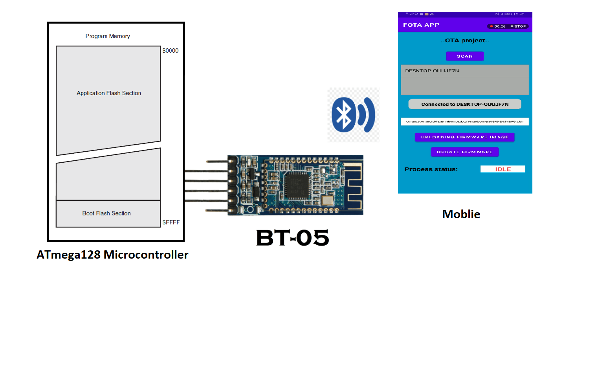

# Project Title
Bluetooth-Based FOTA System for ATmega128 Temperature Controller

## Over-the-air updates
After deploying an IoT device, it doesn’t mean the development is finished forever. On the contrary,
this is the most important stage in the life cycle of an IoT product and still requires active
development. We might want to add new features as a response to the users’ needs or it might be
a necessity to improve the product security after discovering a potential risk. In either case, we
need to have a means to update the firmware remotely without physically touching the deployed
IoT products. Over-the-air (OTA) update techniques provide this capability.

## Benefits of FOTA updates
Firmware over-the-air updates provide multiple benefits both to users and device vendors:
1. User convenience: Users do not have to manually check for updates and do not have to connect their devices to their computers and download special software to update them.
2. Improved security: Devices that are up to date are more secure, and updates will not be “put off” until a later time, or forgotten about.
3. New features, bug fixes, and better device performance: FOTA ensures that users have the latest bug fixes and features, improving functionality, stability, and performance.
4. Better outcomes for manufacturers: Rather than recalling faulty devices, manufacturers can deploy firmware over-the-air updates to fix devices in the field. They can also test updates on a subset of users who have opted in, to make sure that updates are reliable before wider deployment, improving reliability and brand perception.

## Project Description:
This project implements a Firmware Over-The-Air (FOTA) update system for an Automatic Temperature Controller using Bluetooth communication between an Android app and an ATmega128 microcontroller.

The system reads temperature values and compares them with a user-defined reference:
1. If actual temperature < reference, it activates the heater.
2. If actual temperature > reference, it activates the cooler.
3. 

## Technologies Used
1. ATmega128 Microcontroller (AVR)
2. HC-05 Bluetooth Module
3. UART Serial Protocol
4. Temperature sensor (LM35)
5. LCD + Keypad for interface
6. Custom Bootloader for OTA Flashing
7. Android Studio (Java)

## How Wireless OTA works(Bluetooth FOTA)
The system uses a BT-05 Bluetooth module connected via USART to the ATmega128.

A custom Android FOTA app is used to:
1. Scan and select paired devices.
2. Upload a .bin firmware file.
3. Send the binary over Bluetooth to the ATmega128 using uart.
4. The MCU writes the firmware into flash using a custom bootloader.

